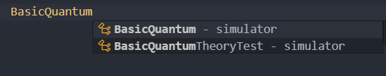
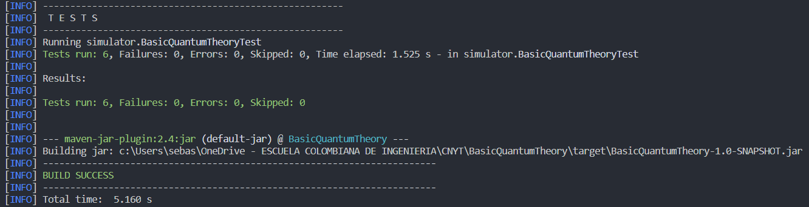

# Teoría Cuántica básica - LAB5 CNYT

1. Sistema de la posición de la partícula en una recta. Usuario especifica el número de puntos posibles y un vector ket y el sistema calcula las probabilidades de encontrar partícula en una posición. El sistema puede recibir dos vectores y calcular la probabilidad de transitar de el uno al otro después de hacer la observación

2. Ahora con una matriz que describa un observable y un vector ket, el sistema revisa que la matriz sea hermitiana, y si lo es, calcula la media y la varianza del observable en el estado dado.

3. El sistema calcula los valores propios del observable y la probabilidad de que el sistema transite a alguno de los vectores propios después de la observación.

4. Se considera la dinámica del sistema. Ahora con una serie de matrices Un el sistema calcula el estado final a partir de un estado inicial.

## Para empezar

Estas instrucciones le proporcionarán una copia del proyecto en funcionamiento en su máquina local para fines de desarrollo y pruebas.

### Prerrequisitos

Qué cosas necesitas para instalar el Software:

- Maven
- Java 8+

### Instalando y corriendo

A continuación veras los pasos a seguir para la instalación del software

1. Clona el proyecto en tu maquina.

    ``` console
    git clone https://github.com/SebastianGoenaga/BasicQuantumTheory
    ```

2. Entra al directorio recién clonado.

3. Ejecuta los siguientes comandos:
    - Compila nuestro código. De los .java genera los .class.  
    `mvn compile`
    - Compila las pruebas.  
    `mvn test-compile`
    - Ejecuta las pruebas.  
    `mvn test`

### Cómo usar la libreria

1. Copie las siguientes etiquetas en su archivo pom.xml:

    ~~~ xml
    <repositories>
        <repository>
            <id>jitpack.io</id>
            <url>https://jitpack.io</url>
        </repository>
    </repositories>

    <dependencies>
        <dependency>
            <groupId>com.github.SebastianGoenaga</groupId>
            <artifactId>BasicQuantumTheory</artifactId>
            <version>master-SNAPSHOT</version>
        </dependency>
    </dependencies>
    ~~~

2. A continución ya debería ser capaz de usar la librería completa como se muestra en la siguiente imagen de ejemplo.

    

3. Recuerde acceder a la librería de forma estática.

4. A continuación tiene un ejemplo del uso de la librería.

Asociado a `likeliHood`, que es el método encargado de calcular la probabilidad de que una particula esté en una posición determinada (parametro del metodo).

~~~ java
    ComplexVector vector = new ComplexVector(4);

    // mat1
    Complex c1 = new Complex(-3, -1);
    Complex c2 = new Complex(0, -2);
    Complex c3 = new Complex(0, 1);
    Complex c4 = new Complex(2, 0);

    // add

    vector.addToMatrix(0, c1);
    vector.addToMatrix(1, c2);
    vector.addToMatrix(2, c3);
    vector.addToMatrix(3, c4);

    QuantumStatesSystem system = new QuantumStatesSystem(vector);

    double answer = system.likeliHood(2);
~~~

A continuación tiene un ejemplo `transitionAmplitudes`, que calcula la probabilidad de transitar de un vector a otro.

~~~ java

    ComplexVector vector = new ComplexVector(2);
    ComplexVector vector2 = new ComplexVector(2);

    // mat1
    Complex c1 = new Complex(1, 0);
    Complex c2 = new Complex(0, -1);
    Complex c3 = new Complex(0, 1);
    Complex c4 = new Complex(1, 0);

    // add

    vector.addToMatrix(0, c1);
    vector.addToMatrix(1, c2);
    vector2.addToMatrix(0, c3);
    vector2.addToMatrix(1, c4);

    QuantumStatesSystem system = new QuantumStatesSystem(vector);

    Complex answer = system.transitionAmplitudes(vector2);
~~~

A continuación tiene un ejemplo `variance`.

~~~ java

    ComplexMatrix mat1 = new ComplexMatrix(2, 2);
    ComplexVector ket2 = new ComplexVector(2);

    Complex c1 = new Complex(1, 0);
    Complex c2 = new Complex(0, -1);
    Complex c3 = new Complex(0, 1);
    Complex c4 = new Complex(2, 0);
    Complex c5 = new Complex(Math.sqrt(2) / 2.0, 0);
    Complex c6 = new Complex(0, Math.sqrt(2) / 2.0);

    mat1.addToMatrix(0, 0, c1);
    mat1.addToMatrix(0, 1, c2);
    mat1.addToMatrix(1, 0, c3);
    mat1.addToMatrix(1, 1, c4);

    ket2.addToMatrix(0, c5);
    ket2.addToMatrix(1, c6);

    Complex result = BasicQuantum.variance(mat1, ket2);
    Complex result1 = new Complex(Math.round(result.getpReal() * 100.0) / 100.0,
    Math.round(result.getpImg() * 100.0) / 100.0);
~~~

A continuación tiene un ejemplo `mean`.

~~~ java

    ComplexMatrix mat1 = new ComplexMatrix(2, 2);
    ComplexVector ket2 = new ComplexVector(2);

    Complex c1 = new Complex(1, 0);
    Complex c2 = new Complex(0, -1);
    Complex c3 = new Complex(0, 1);
    Complex c4 = new Complex(2, 0);
    Complex c5 = new Complex(Math.sqrt(2) / 2.0, 0);
    Complex c6 = new Complex(0, Math.sqrt(2) / 2.0);

    mat1.addToMatrix(0, 0, c1);
    mat1.addToMatrix(0, 1, c2);
    mat1.addToMatrix(1, 0, c3);
    mat1.addToMatrix(1, 1, c4);

    ket2.addToMatrix(0, c5);
    ket2.addToMatrix(1, c6);

    Complex result = BasicQuantum.mean(mat1, ket2);
    Complex result1 = new Complex(Math.round(result.getpReal() * 100.0) / 100.0,
    Math.round(result.getpImg() * 100.0) / 100.0);
~~~

A continuación tiene un ejemplo `valProp`.

~~~ java

    ComplexMatrix mat1 = new ComplexMatrix(2, 2);
    Complex c1 = new Complex(-1, 0);
    Complex c2 = new Complex(0, -1);
    Complex c3 = new Complex(0, 1);
    Complex c4 = new Complex(1, 0);

    mat1.addToMatrix(0, 0, c1);
    mat1.addToMatrix(0, 1, c2);
    mat1.addToMatrix(1, 0, c3);
    mat1.addToMatrix(1, 1, c4);

    ComplexVector result = BasicQuantum.valProp(mat1);
~~~

A continuación tiene un ejemplo `dinamica`.

~~~ java

    ComplexMatrix mat1 = new ComplexMatrix(2, 2);
    Complex c1 = new Complex(-1, 0);
    Complex c2 = new Complex(0, -1);
    Complex c3 = new Complex(0, 1);
    Complex c4 = new Complex(1, 0);

    mat1.addToMatrix(0, 0, c1);
    mat1.addToMatrix(0, 1, c2);
    mat1.addToMatrix(1, 0, c3);
    mat1.addToMatrix(1, 1, c4);

    ComplexVector ket2 = new ComplexVector(2);

    Complex c5 = new Complex(-Math.sqrt(2), 0);
    Complex c6 = new Complex(Math.sqrt(2), 0);

    ket2.addToMatrix(0, c5);
    ket2.addToMatrix(1, c6);
    ComplexVector result = BasicQuantum.dinamica(2, ket2, mat1);
~~~

### Ingresar casos de prueba

Los siguientes archivos son los que tendrá que modificar si quiere probar otros casos.
`src\test\java\simulator\BasicQuantumTheoryTest.java`

Es posible modificar cualquier caso de prueba para corroborar la efectividad del programa.

El resultado al finalizar y ejecutar nuevamente los comandos anteriormente indicados para ejecutar las pruebas, el resultado deberá ser el siguiente:



## Authors

- **Sebastián Goenaga**  -  _Initial work_  -  [BasicQuantumTheory](https://github.com/SebastianGoenaga/BasicQuantumTheory)

## License

This project is licensed under the MIT License - see the  [LICENSE.md](https://github.com/SebastianGoenaga/BasicQuantumTheory/blob/master/LICENSE)  file for details
